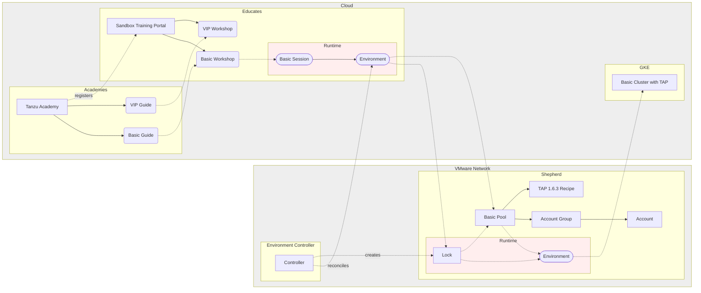

# TAP Sandbox Architecture

```mermaid

flowchart LR
    subgraph vmware[VMware Network]
        subgraph Environment Controller
            ctrl[Controller]
        end

        subgraph Shepherd
            accGroup[Account Group]-->acc[Account]
            pool[Basic Pool]-->accGroup
            pool-->recipe[TAP 1.6.3 Recipe]

            subgraph shepherdRuntime[Runtime]
                environment([Environment])
                lock[Lock]-.->environment
            end

            pool -.-> environment
        end
    end

    subgraph cloud[Cloud]
        subgraph Academies
            tanzuAcademy[Tanzu Academy]-->basicGuide(Basic Guide)
            tanzuAcademy-->vipGuide(VIP Guide)
        end

        subgraph Educates
            trainingPortal[Sandbox Training Portal]-->basicWorkshop(Basic Workshop)
            trainingPortal-->vipWorkshop(VIP Workshop)

            subgraph educatesRuntime[Runtime]
                session([Basic Session])-->env([Environment])
            end

            basicWorkshop-.->session
        end

        subgraph GKE
            cluster[Basic Cluster with TAP]
        end
    end

    ctrl -.-> |reconciles| env
    env -.-> lock
    lock -.-> pool
    env -.-> pool

    ctrl -.-> |creates| lock
    environment-.->cluster
    tanzuAcademy -.-> |registers| trainingPortal

    basicGuide-.->basicWorkshop
    vipGuide-.->vipWorkshop

    classDef net fill:#eee
    classDef rt fill:#fee
    class vmware,cloud net
    class shepherdRuntime,educatesRuntime rt

```
